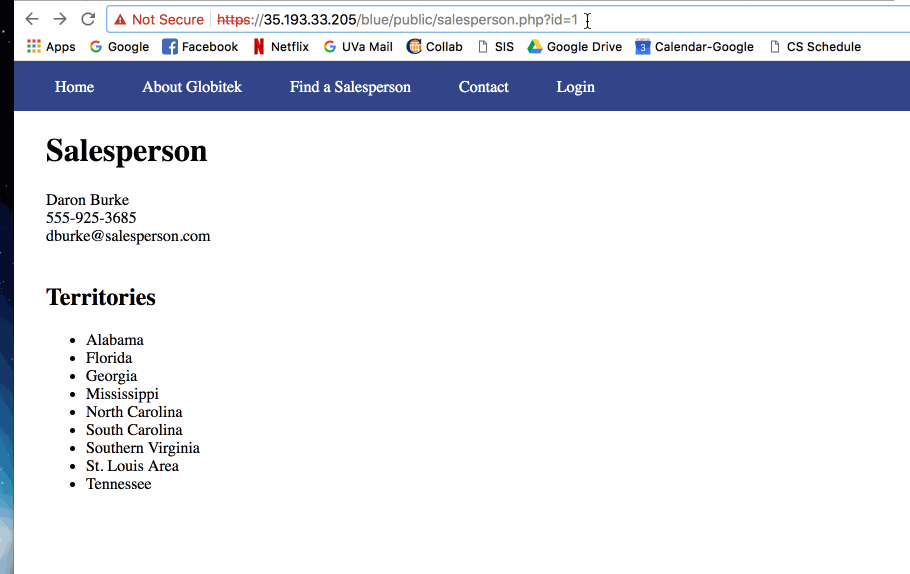
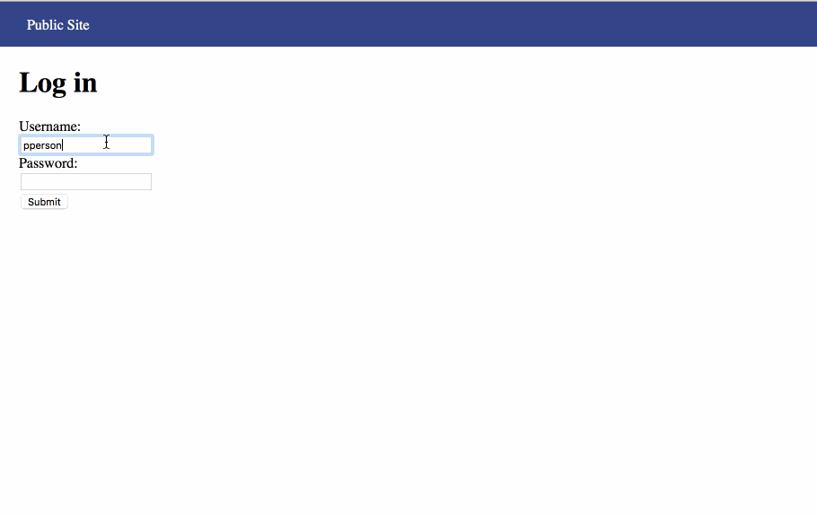
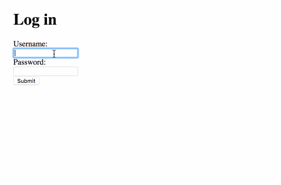
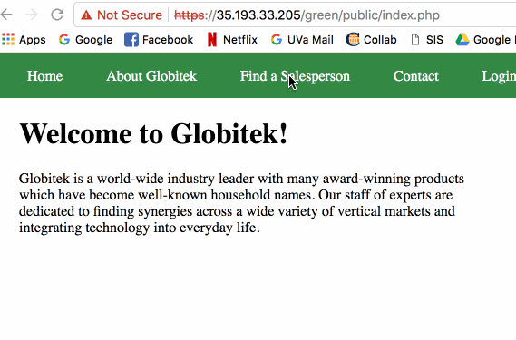
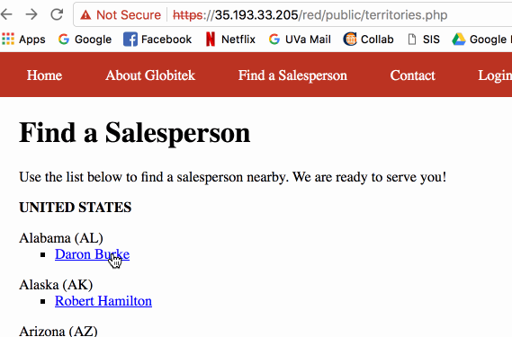

# Project 8 - Pentesting Live Targets

Time spent: 3 hours spent in total

> Objective: Identify vulnerabilities in three different versions of the Globitek website: blue, green, and red.

The six possible exploits are:
* Username Enumeration
* Insecure Direct Object Reference (IDOR)
* SQL Injection (SQLi)
* Cross-Site Scripting (XSS)
* Cross-Site Request Forgery (CSRF)
* Session Hijacking/Fixation

Each version of the site has been given two of the six vulnerabilities. (In other words, all six of the exploits should be assignable to one of the sites.)

## Blue

Vulnerability #1: SQLi -- One was able to inject sequel code in the id portion of the web address to cause the website to "sleep," shown as loading for several moments. The other sites where able to sanitize this and thus did not sleep at all when this injection was done.

Vulnerability #2: Session Hijacking/Fixation -- It was possible to log in on Safari, take the session ID created there, and then go back to Google Chrome and use that session ID to get full access without having to log in.

## Green

Vulnerability #1: Username Enumeration -- Green unbolded "Login Unsuccessful" when not a user, while the other two did not, creating an username enumeration.

Vulnerability #2: Cross-Site Scripting -- One was able to insert an alert into the feedback form on the website, while the other two sites cleansed this.

## Red

Vulnerability #1: Insecure Direct Object Reference -- Here it was possible to change the id in the web address in order to access the info for a member that otherwise couldn't be seen.

Vulnerability #2: CSRF -- The CSRF could be changed and one was still able to update user information, which caused an error when done on the other sites.

## Notes

-It was initially challenging to determine which parts of the website to attack (for example, to manipulate the web address, or put things into the feedback form, etc.)
